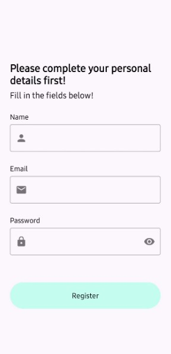
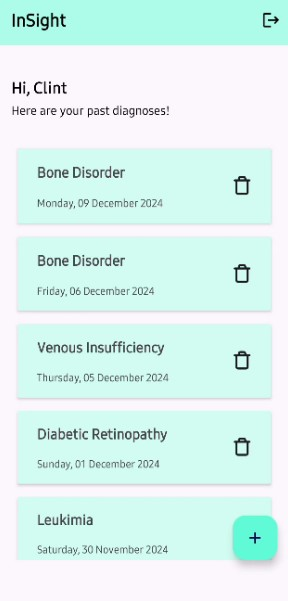
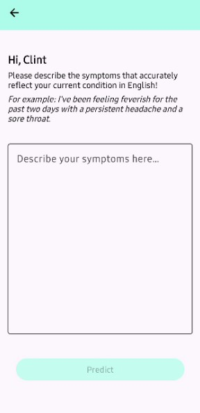
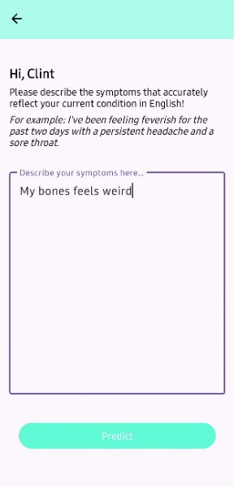
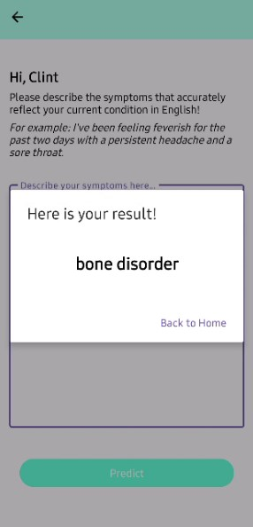

# Google Bangkit 2024 Capstone Android App

InSight - Internal Disease Detection App
 

## Table of Contents
* [General Info](#general-information)
* [Program Display](#program-display)
* [Credits](#credits)

## General Information
InSight is an app to help people detect a potential internal disease through symptoms input.

## Program Display
* Welcome
> 
* Login
> 
* Register
> 
* Homepage
> 
* Symptoms Input - Empty
> 
* Symptoms Input - Filled
> 
* Result
> 

## Credits
This project is implemented by Team C242-PS463.
